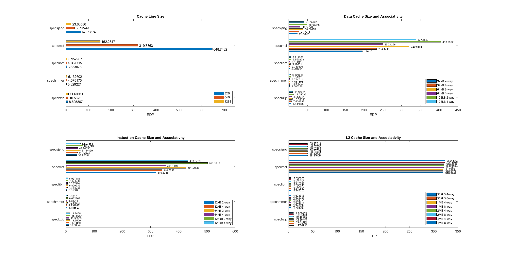

# Computer Architecture

## Lab 3
18/12/2020\
Ilia Zarka 9289\
Iosif Chrysostomou 9130

---

## Step 1

#### 1. Dynamic Power and Leakage
Dynamic power is the power used for gate operations of the transistors, which the CPU consists of. Hence it is proportional to the gate operations (more gate operations -> more power). The energy used to charge one gate equals to **C** * **V² / 2** Joules. This energy though, will be consumed from the power supply only when charging the gate. When discharging it, the energy stored will just turn into heat in the transistor network used for this job. So, assuming the transistor is being used at every clock cycle, the energy used I a second will be (**C** * **V² / 2**) * **f** Watts, where **f** is the frequency of the clock. In this equation we can see one of the reasons why we are trying so hard to shrink down the transistor sizes. Doing so, reduces the gate capacitance, resulting in lower power consumption.

Leakage is an unavoidable loss of energy. This mainly happens because electric charges dissipate over time and currents flow through the gate or through the subthreshold.

With a different program, leakage power should remain at about the same value. The dynamic power, assuming that the number of transistor gates that change per clock tick is different, will change. And since our program calculates the peak dynamic power, the only clock cycle that should matter is the one with the most gate logic changes. So the duration of the program should not matter.

#### 2. Power, Energy and Performance
The output of McPAT gives us only the peak power of the CPU. To calculate the life of a battery supplying power to the CPU we need to divide its capacity with the average power consumption of that CPU. 

To answer this question we had to make some assumptions:
* The battery has no internal resistance
* The battery can handle the current
* The leakage power of the CPU is the same in every case
* The CPUs are given the same tasks and they can both finish them before the battery is dead

So if a CPU that consumes 10 times more peak power than another, it can require less energy to complete a task if it completes it in less than 1/10 of the time of the other one.

If we want to calculate the battery life from the McPAT output, it should give us enough information to calculate the total energy consumption of the CPU for the program. So it could either give us that number or an average power consumption and an estimated time that it would take to run the program.

#### 3. Power consumption in different architectures

* Intel Xeon
* ARM A9

Since the two systems will not turn off after the completion of the program, even if the ARM CPU would run only on its peak power (1.74W) and the Xeon CPU on its leakage power (36.8W), the Xeon CPU would have no chance of consuming less energy over time. The difference only increases when we factor in the 134.9W of peak power for the xeon.

## Step 2

#### EDP and PDP

Power-Delay Product (PDP) and Energy-Delay Product (EDP) are two figures of merit which are used to assess power and energy efficiency relatively to performance. In the case of this exercise, in our MinorCPU model we examined Runtime Dynamic, Subthreshold Leakage and Gate Leakage as the power used by each component in every stage of its cycle. Τhe compoments used are the Core (single processor model), which includes L1 caches and L2 cache since they take up most of the area of the modeled chip.

* PDP was calculated by this formula: `PDP = (coreRtDyn + coreSubLeakage + coreGateLeakage + L2RtDyn + L2SubLeakage + L2GateLeakage) * Runtime`
* EDP was calculated by this formula: `EDP = (coreRtDyn + coreSubLeakage + coreGateLeakage + L2RtDyn + L2SubLeakage + L2GateLeakage) * Runtime^2` or simply `PDP * Rutime`

**Power** values where extracted from the output of McPAT tool and **time** value (Runtime) was extracted from gem5 stats output.

Both EDP and PDP where calculated for every parameter case that was simulated during [Lab 2](https://github.com/JoeChrys/computer_architecture_ex2)

PDP results can be viewed here: [PDP values for each parameter](./images/pdp.png)

#### Possible Inaccuracies in results

The produced results could vary when applied in silicon. Firstly, the software doesn't have a complete image of the CPU at any given time, instead its results occur on stats based on the execution of a program. Secondly, different lithography technologies could have different power consumption values for the same transistor size.

#### Possible Errors introduced by combining 2 simulators

In our results we used 2 different software, gem5 and McPAT to extract data for power consumtion. Gem5 uses a model (in this case MinorCPU) to simulate the behaviour of a CPU. McPAT uses a template to model the power values of a CPU based on the parameters it is given. The parameters given to McPAT are extracted from the output of gem5. To summarize, the final result can be affected by the following error sources:

* Inaccuracies of gem5's model
* Inaccuracies in McPAT's calculations since it cannot have a complete image of the powerflow in the chip
---
## Feedback
Overall, we really enjoyed learning yet another tool for simulating computer architectures and it was really satisfying seeing them confirm the theory from the lectures. One complaint we had from the second and third lab exercise is the fact that it was repetitive, and we feel like we learned more about linux and programing than we did about computer architecture. We did like that but if the labs purpose is to learn more about architecture, we feel like we should be given more ready made scripts to save some time and emphasize more on the research component.
---
## Sources
* [Proseccor Power Dissipation](https://en.wikipedia.org/wiki/Processor_power_dissipation)
* [Capacitor Energy-Charge](http://hyperphysics.phy-astr.gsu.edu/hbase/electric/capeng.html)
* [Calculating Dynamic Power](https://electronics.stackexchange.com/questions/101988/dynamic-energy-and-dynamic-power-in-microprocessors)

